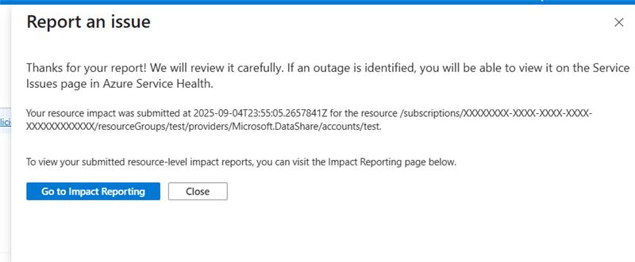

# Report Impact (Preview)
> [!IMPORTANT]
> Azure Impact Reporting is currently in Preview. See the [Supplemental Terms of Use for Microsoft Azure Previews](https://azure.microsoft.com/support/legal/preview-supplemental-terms/) for legal terms that apply to Azure features that are in beta, preview, or otherwise not yet released into general availability.

In addition to Azure Service Health "Report an Issue" and our REST API, you can also report an impact automatically using an Azure Monitor [connector](./azure-monitor-connector.md) when certain alerts get triggered.

## Report Workload Impact

The following channels can be used to report a workload: 
* Azure Service Health portal blade
* REST API

#### [Azure Service Health](#tab/ash/)
To report an issue, follow these steps.
1. Select **Report an Issue**.

[  ](images/report-an-issue-main.png#lightbox)

2. Select **Single resource**.

[  ](images/report-an-issue-submit.png#lightbox)

3. Fill out the required fields.
    - Subscription
    - Impacted resource
    - What is the business impact?
    - Impact start date and time.
4. Select **Submit**.

When your issue is reported, you should see this message. 
[  ](images/report-an-issue-success.png#lightbox)

If an outage is found, you will see it on the portal.

If you get this error, it means you don’t have permission.

[  ](images/report-an-issue-error.png)


#### [REST API](#tab/api/)
> [!TIP]
> Given that most workloads have monitoring in place to detect failures, we recommend creating an integration through a logic app or Azure Function to file an impact report when your monitoring identifies a problem that you think is due to the platform.
>
Review our full [REST API reference](https://aka.ms/ImpactRP/APIDocs) for more examples.

```json
{
  "properties": {
    "impactedResourceId": "/subscriptions/<Subscription_id>/resourcegroups/<rg_name>/providers/Microsoft.Compute/virtualMachines/<vm_name>",
    "startDateTime": "2022-11-03T04:03:46.6517821Z",
    "endDateTime": null, //or a valid timestamp if present
    "impactCategory": "Resource.Availability", //valid impact category needed
    "workload": { "name": "webapp/scenario1" }
  }
}
```

```rest
az rest --method PUT --url "https://management.azure.com/subscriptions/<Subscription_id>/providers/Microsoft.Impact/workloadImpacts/<impact_name>?api-version=2022-11-01-preview"  --body <body_above>

```

---

## Next steps

- [Get allowed impact category list](view-impact-categories.md)
- [View insights from reported issues](view-impact-insights.md)
